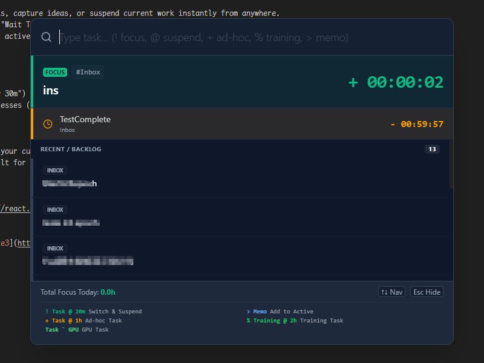

# EpochToDo

> **Focus on what matters. Seamlessly switch contexts. Never lose track.**

EpochToDo is a powerful desktop task management application designed for developers and knowledge workers who handle high-frequency context switching. It combines a sophisticated timer system, a command-line interface (Spotlight), and background task tracking (including GPU training tasks) into a single, keyboard-centric workflow. 

The most suitable users for this project are deep learning researchers exhibiting symptoms of ADHD. It offers specialized GPU management and reminder features to help researchers maintain focus and avoid attention scattering issues that arise from frequently switching tasks.

Code is completed 100% by Antigravity AI.


## 🆕 Recent Updates (v1.1.0)

- **Improved Task Enforcement**: Mandatory project selection when completing tasks reduces uncategorized archives.
- **Nagging Reminders**: Persistent periodic alerts (default 15m) for expired tasks ensure nothing slips through cracks.
- **Universal Snooze**: The "+5min" snooze functionality now works for all task types, including ADHOC and Standard tasks.

## 🚀 Key Features

### 🧠 Context Switching Optimized
- **Spotlight (`Alt + Space`)**: A global command bar to switch tasks, capture ideas, or suspend current work instantly from anywhere.
- **Suspend & Resume**: Instantly suspend your current focus with a "Wait Timer" (e.g., waiting for compilation, deployment, or a reply) and switch to a new task.


### ⏱️ Advanced Timer System
- **Standard Focus**: Stopwatch for your primary active task.
- **Background Wait Timers**: Countdowns for suspended tasks.
- **Ad-Hoc Tasks**: Temporary timers for life chores (e.g., "Laundry 30m") that run in the background.
- **Training/GPU Tasks**: Specialized trackers for long-running processes (like ML model training) linked to specific GPU resources.

### 🎨 Visual & Immersive
- **Timeline**: Visual history of your day's focus sessions.
- **Overlay**: A persistent, unobtrusive transparent window showing your current focus and remaining wait times.
- **Immersive Dashboard**: Dark-themed, keyboard-first interface built for speed.

## 🛠️ Technology Stack

- **Core**: [Electron](https://www.electronjs.org/), [React](https://react.dev/), [TypeScript](https://www.typescriptlang.org/)
- **Build Tool**: [Vite](https://vitejs.dev/)
- **Styling**: [TailwindCSS](https://tailwindcss.com/)
- **Database**: [SQLite](https://www.sqlite.org/) (via [Better-SQLite3](https://github.com/WiseLibs/better-sqlite3) & [Kysely](https://kysely.dev/))
- **State Management**: [Zustand](https://github.com/pmndrs/zustand)

## 📦 Getting Started

### Prerequisites
- Node.js (v18+ recommended)
- npm or pnpm

### Installation

1. Clone the repository
   ```bash
   git clone https://github.com/yourusername/epoch-todo.git
   cd epoch-todo
   ```

2. Install dependencies
   ```bash
   npm install
   ```

3. Run in Development Mode
   ```bash
   npm run dev
   ```

4. Build for Production
   ```bash
   npm run build
   ```

## ⌨️ Command Guide (Spotlight)

Press `Alt + Space` to open Spotlight.

| Command | Description | Example |
|str|str|str|
| **`! [Task]`** | **Switch & Focus** (Default) | `! Debug API` |
| **`@ [Time]`** | **Suspend Current** | `@ 20m` (Wait 20 mins) |
| **`> [Note]`** | **Add Memo** | `> Fixed the login bug` |
| **`+ [Task] @ [Time]`** | **Ad-Hoc Timer** | `+ Pizza @ 15m` |
| **`% [Task]`** | **Queue Training** | `% SDXL Fine-tuning` |
| **`[Task] ` [GPU]`** | **Assign GPU** | `Training` ` 4090 @ 2h` |

> For a detailed user manual in Chinese, please refer to [docs/USER_MANUAL_CN.md](docs/USER_MANUAL_CN.md).

## 📄 License

[MIT](LICENSE) © 2024 EpochToDo Contributors
