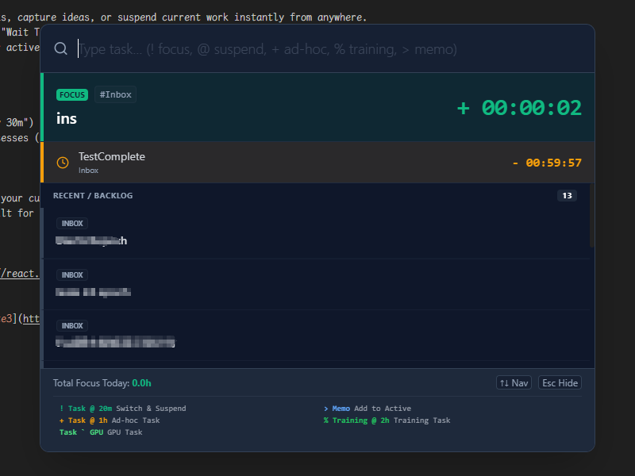

# EpochToDo

> **Focus on what matters. Seamlessly switch contexts. Never lose track.**

EpochToDo is a powerful desktop task management application designed for developers and knowledge workers who handle high-frequency context switching. It combines a sophisticated timer system, a command-line interface (Spotlight), and background task tracking (including GPU training tasks) into a single, keyboard-centric workflow. 

> **📖 User Manual / 使用说明书**: 对于中文用户，请查看详细的 [User Manual (CN)](docs/USER_MANUAL_CN.md) 了解所有功能和指令。 

The most suitable users for this project are deep learning researchers exhibiting symptoms of ADHD. It offers specialized GPU management and reminder features to help researchers maintain focus and avoid attention scattering issues that arise from frequently switching tasks.

Code is completed 100% by Antigravity AI.


## 🆕 Recent Updates

### v1.2.0

- **wandb GraphQL Integration**: Auto-detects running training from [Weights & Biases](https://wandb.ai), auto-creates GPU cards with real-time metrics (cfg name, ETA, epoch progress, hostname, GPU model).
- **GPU Card Redesign**: Each card shows config name (top), ETA + estimated end time, hostname · GPU model, and epoch/iter progress. wandb link included.
- **Overlay Training**: Floating overlay shows 3 most recent training runs with their end times — no hostname clutter.
- **Spotlight Right-Click Menu**: Right-click any countdown task to reset timer, cancel countdown, or complete. Supports `30m`/`1h`/`45s` time input.
- **Webhook Deduplication**: When wandb is active, webhook training updates are auto-skipped to prevent duplicate GPU cards.
- **Bug Fixes**: Settings cache `JSON.parse` fix (entity names no longer wrapped in quotes), wandb project discovery now sorts by `lastActive` instead of stale `updatedAt`.

### v1.1.0

- **Improved Task Enforcement**: Mandatory project selection when completing tasks reduces uncategorized archives.
- **Nagging Reminders**: Persistent periodic alerts (default 15m) for expired tasks ensure nothing slips through cracks.
- **Universal Snooze**: The "+5min" snooze functionality now works for all task types, including ADHOC and Standard tasks.

## 🚀 Key Features

### 🧠 Context Switching Optimized
- **Spotlight (`Alt + Space`)**: A global command bar to switch tasks, capture ideas, or suspend current work instantly from anywhere.
- **Suspend & Resume**: Instantly suspend your current focus with a "Wait Timer" (e.g., waiting for compilation, deployment, or a reply) and switch to a new task.


### ⏱️ Advanced Timer System
- **Standard Focus**: Stopwatch for your primary active task.
- **Background Wait Timers**: Countdowns for suspended tasks.
- **Ad-Hoc Tasks**: Temporary timers for life chores (e.g., "Laundry 30m") that run in the background.
- **Training/GPU Tasks**: Specialized trackers for long-running processes (like ML model training) linked to specific GPU resources.

### 🎨 Visual & Immersive
- **Timeline**: Visual history of your day's focus sessions.
- **Overlay**: A persistent, unobtrusive transparent window showing your current focus, wait timers, and training ETAs.
- **Immersive Dashboard**: Dark-themed, keyboard-first interface built for speed.

### 🏋️ wandb Integration
- **Auto GPU Cards**: Running a training on any machine? EpochToDo polls wandb every 30s, auto-creates a GPU card showing config name, ETA, epoch progress, hostname, and GPU model.
- **Zero Config**: Enter your wandb entity + API key in Settings → the app handles the rest. No webhook scripts needed.
- **Webhook Fallback**: Don't use wandb? The legacy webhook system (`POST http://127.0.0.1:62222/hook`) still works as a fallback.

### 🤖 AI Hook (Let your AI assistant talk to EpochToDo)
EpochToDo listens on `http://127.0.0.1:62222/hook`. Your AI coding assistant (Claude Code, Cursor, OpenCode, CI bots) can push **soft reminders** — build results, task completions, review requests — straight to your desktop without popups or focus stealing.

**Quick start (Claude Code example):**
```jsonc
// ~/.claude/settings.json
{
  "hooks": {
    "Stop": [{
      "hooks": [{
        "type": "command",
        "command": "jq -rc '{kind:\"ai\",source:\"Claude Code\",title:(.stop_hook_reason // \"done\"),status:\"info\"}' | curl -s -X POST http://127.0.0.1:62222/hook -H 'Content-Type: application/json' -d @- --max-time 2 || true"
      }]
    }]
  }
}
```

**Minimal curl:**
```bash
curl -s -X POST http://127.0.0.1:62222/hook \
  -H "Content-Type: application/json" \
  -d '{"kind":"ai","source":"My Bot","title":"Build passed","status":"success"}'
```

> 📖 Full guide (payload fields, status semantics, integration patterns for OpenCode/Cursor/CI): see [docs/AI_REMINDER_HOOK_GUIDE.md](docs/AI_REMINDER_HOOK_GUIDE.md)

## 🛠️ Technology Stack

- **Core**: [Electron](https://www.electronjs.org/), [React](https://react.dev/), [TypeScript](https://www.typescriptlang.org/)
- **Build Tool**: [Vite](https://vitejs.dev/)
- **Styling**: [TailwindCSS](https://tailwindcss.com/)
- **Database**: [SQLite](https://www.sqlite.org/) (via [Better-SQLite3](https://github.com/WiseLibs/better-sqlite3) & [Kysely](https://kysely.dev/))
- **State Management**: [Zustand](https://github.com/pmndrs/zustand)

## 📦 Getting Started

### Prerequisites
- Node.js (v18+ recommended)
- npm or pnpm

### Installation

1. Clone the repository
   ```bash
   git clone https://github.com/yourusername/epoch-todo.git
   cd epoch-todo
   ```

2. Install dependencies
   ```bash
   npm install
   ```

3. Run in Development Mode
   ```bash
   npm run dev
   ```

4. Build for Production
   ```bash
   npm run build
   ```

## ⌨️ Command Guide (Spotlight)

Press `Alt + Space` to open Spotlight.

| Command | Description | Example |
|str|str|str|
| **`! [Task]`** | **Switch & Focus** (Default) | `! Debug API` |
| **`@ [Time]`** | **Suspend Current** | `@ 20m` (Wait 20 mins) |
| **`> [Note]`** | **Add Memo** | `> Fixed the login bug` |
| **`+ [Task] @ [Time]`** | **Ad-Hoc Timer** | `+ Pizza @ 15m` |
| **`% [Task]`** | **Queue Training** | `% SDXL Fine-tuning` |
| **`[Task] ` [GPU]`** | **Assign GPU** | `Training` ` 4090 @ 2h` |

> For a detailed user manual in Chinese, please refer to [docs/USER_MANUAL_CN.md](docs/USER_MANUAL_CN.md).

### Right-Click Context Menu (v1.2.0)

Right-click any task in Spotlight for quick actions:

| Action | Available On | Description |
|--------|-------------|-------------|
| **Reset Countdown** | Waiting/Training tasks | Enter a new time (`30m`, `1h`, `45s`) |
| **Cancel Countdown** | Waiting/Training tasks | Return task to queue |
| **Complete Task** | Any task | Archive immediately |

## 📄 License

[MIT](LICENSE) © 2024 EpochToDo Contributors
